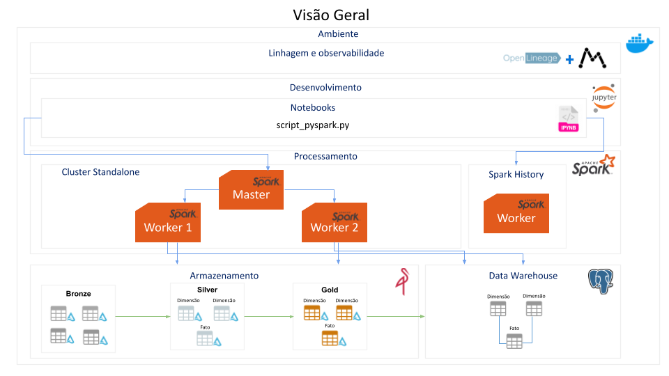
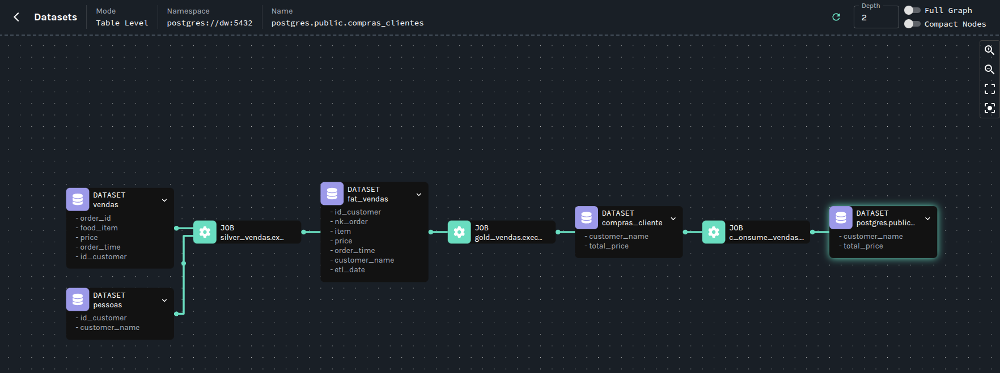
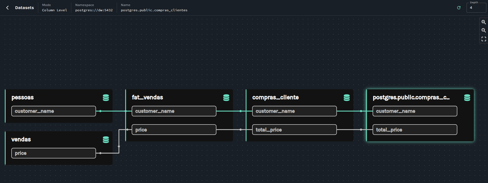

# spark-openlineage

Este projeto configura um ambiente de processamento de dados utilizando **Apache Spark**, **Jupyter**, **MinIO**, **PostgreSQL** e **OpenLineage** com suporte a múltiplos workers, execução distribuída de tarefas, observabilidade e linhagem de dados.

 Este ambiente é destinado apenas para uso local e fins de desenvolvimento.

# Ambiente


## Linhagem de dados



# Como executar
```
./start_openlineage.sh
```
```
docker compose up -d --build
```
# Versões utilizadas
- python:3.12
- spark-3.5.6

# Endereços
- Marquez: http://localhost:3000/
- Jupyter: http://localhost:8888/
- Minio: http://localhost:9001/
- Spark UI: http://localhost:8080/
- Spark History: http://localhost:18080/
